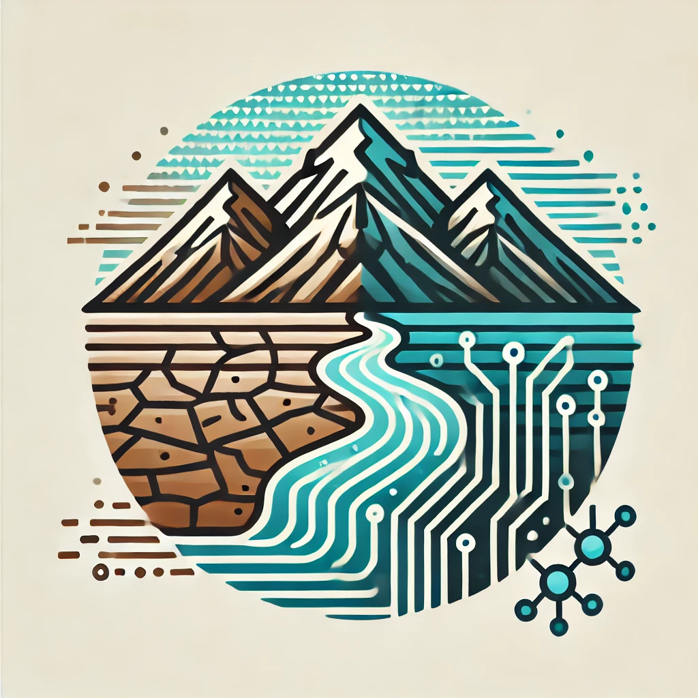

# InterTwin HyDroForM



## Table of Contents

- [Introduction](#introduction)
- [Repository structure](#repository-structure)
- [Environment setup](#environment-setup)
- [Use case components](#use-case-components)
    - [HydroMT](#hydromt)
    - [Wflow](#wflow)
    - [Surrogate model based on ItwinAI](#surrogate-model-based-on-it
winai)
- [OSCAR](#oscar)
- [Running the use case using openEO and OSCAR](#running-the-use-case-using-openeo-and-oscar)
- [openEO OSCAR integration](#openeo-oscar-integration)
- [Tests](#tests)
- [License](#license)
- [Project framework](#project-framework)

## Introduction

HyDroForM stands for "Hydrological Drought Forecasting Model with HydroMT and Wflow". It is a Digital Twin for Drought Early Warning in the Alps developed as a use case for the [InterTwin project](https://www.intertwin.eu/). The details of the use case are also available online [here](https://www.intertwin.eu/intertwin-use-case-a-digital-twin-for-drought-early-warning-in-the-alps).

InterTwin components used in this use case are:

- [OpenEO](https://openeo.org/)
- [raster-to-stac](https://pypi.org/project/raster2stac/)
- [DownscaleML](https://github.com/suriyahgit/downScaleML)
- [openeo-pg-parser-networkx](https://github.com/Open-EO/openeo-pg-parser-networkx)
- [openeo-processes-dask](https://github.com/Open-EO/openeo-processes-dask)
- [HydroMT-Sfincs](https://github.com/Deltares/hydromt_sfincs)
- [ItwinAI](https://github.com/interTwin-eu/itwinai)
- [OSCAR](https://github.com/grycap/oscar)
- [Hython](https://github.com/interTwin-eu/hython)

## Repository structure

- `Archive`: contains older versions and CWL descriptions of the use case
- `docker`: contains the Dockerfiles and scripts to build and run the components of the use case
- `docs`: documentation and images
- `example`: example files for running the use case
- `OSCAR`: contains the OSCAR deployment files for the use case
- `scripts`: helper scripts used during the development of the use case
- `tests`: scripts to test the components of the use case
- `environment.yaml`: conda environment file to set up the development environment

## Environment setup

To develop and test locally, use the provided `environment.yaml` file to create a conda environment:

```bash
conda env create -f environment.yaml
conda activate hydroform
```

## Use case components

There are **three main components** in the HyDroForM use case:

### HydroMT

HydroMT is an open-source Python package that facilitates the process of building and analyzing spatial geoscientific models with a focus on water system models. It does so by automating the workflow to go from raw data to a complete model instance which is ready to run and to analyse model results once the simulation has finished. HydroMT builds on the latest packages in the scientific and geospatial python eco-system including xarray, rasterio, rioxarray, geopandas, scipy and pyflwdir. Source: [Deltares HydroMT](https://deltares.github.io/hydromt/latest/)

### Wflow

Wflow is Deltares’ solution for modelling hydrological processes, allowing users to account for precipitation, interception, snow accumulation and melt, evapotranspiration, soil water, surface water and groundwater recharge in a fully distributed environment. Successfully applied worldwide for analyzing flood hazards, drought, climate change impacts and land use changes, wflow is growing to be a leader in hydrology solutions. Wflow is conceived as a framework, within which multiple distributed model concepts are available, which maximizes the use of open earth observation data, making it the hydrological model of choice for data scarce environments. Based on gridded topography, soil, land use and climate data, wflow calculates all hydrological fluxes at any given grid cell in the model at a given time step.

Source: [Deltares Wflow](https://deltares.github.io/Wflow.jl/stable/)

### Surrogate model based on ItwinAI

`itwinai` is a Python toolkit designed to help scientists and researchers streamline AI and machine learning workflows, specifically for digital twin applications. It provides easy-to-use tools for distributed training, hyper-parameter optimization on HPC systems, and integrated ML logging, reducing engineering overhead and accelerating research. Developed primarily by CERN, in collaboration with Forschungszentrum Jülich (FZJ), itwinai supports modular and reusable ML workflows, with the flexibility to be extended through third-party plugins, empowering AI-driven scientific research in digital twins.

Source: [ItwinAI](https://github.com/interTwin-eu/itwinai)

## OSCAR

OSCAR is an open-source platform to support the event-driven serverless computing model for data-processing applications. It can be automatically deployed on multi-Clouds, and even on low-powered devices, to create highly-parallel event-driven data-processing serverless applications along the computing continuum. These applications execute on customized runtime environments provided by Docker containers that run on elastic Kubernetes clusters. It is also integrated with the SCAR framework, which supports a High Throughput Computing Programming Model to create highly-parallel event-driven data-processing serverless applications that execute on customized runtime environments provided by Docker containers run on AWS Lambda and AWS Batch. [OSCAR](https://github.com/grycap/oscar)

## Running the use case using openEO and OSCAR

The `OSCAR` directory contains the files necessary to deploy the use case on the OSCAR platform. There are 2 main components to do so, a bash script and a yaml service definition file.

These can be found in the respective subdirectories:
`OSCAR/oscar_hydromt`, `OSCAR/oscar_wflow`, and `OSCAR/oscar_surrogate`

To run the use case we have created a sample Jupyter notebook `example/usecase.ipynb` which can be used to run the use case using the openEO API.

The example shows how the three components are linked together to create a drought forecasting workflow.

## openEO OSCAR integration

The integration of openEO with OSCAR is done in the dask/xarray implementation of openEO called `openeo-processes-dask`. The openEO backend is the main orchestration component of the use case. It is responsible for managing the execution of the different components of the use case on OSCAR.

The backend now implements the `oscar_python` library to submit tasks to OSCAR from the process graph.

When the process graph is executed, the `run_oscar` process authenticates with the OSCAR platform, validates the service definition file and submits the job to OSCAR. The process then monitors the job status and retrieves the results once the job is completed. If the service definition contains a process not yet registered in OSCAR it will be created on the fly. The process parameters are passed as environment variables to the container where the scripts are executed. The results are stored as STAC collections and returned to openEO as a string URL to the collection.

## Tests

The components of the use case are set up in `Docker containers`. We have a set of scripts available to build and run the base images. These can be found in the `/tests` directory and can be run from `root` directory of the repository.

For example:

```bash
./tests/test_hydromt.sh
```

## License

This project is licensed under the Apache 2.0 - see the [LICENSE](LICENSE) file for details.

## Project framework

interTwin is an EU-funded project with the goal to co-design and implement the prototype of an interdisciplinary Digital Twin Engine – an open source platform based on open standards that offers the capability to integrate with application-specific Digital Twins.

interTwin is funded by the European Union Grant Agreement Number 101058386
